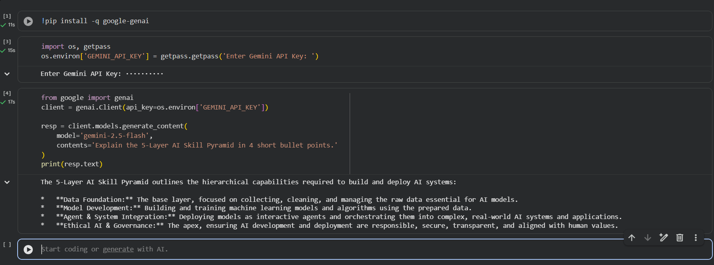

## Day 1 — Setup complete

- ✅ Google AI Studio API key provisioned
- ✅ Groq API key provisioned
- ✅ Hello-Gemini call working — see [Day1_Setup.ipynb](Day1_Setup.ipynb)
- 4-tool comparison matrix from Lab 1A: see screenshot below




## Day 2 — Labs Complete

### Day 2 Lab 2A: Six-Pattern Drills
Rewrote the student query *"Explain Big-O notation for a placement interview"* in six structurally distinct prompting patterns and peer-scored them:
- Pattern 1: **PERSONA** (Score: 9/10)
- Pattern 2: **FEW-SHOT** (Score: 8/10)
- Pattern 3: **CHAIN-OF-THOUGHT** (Score: 9/10)
- Pattern 4: **STRUCTURED OUTPUT** (Score: 8/10)
- Pattern 5: **SYSTEM PROMPT** (Score: 9/10)
- Pattern 6: **PROMPT CHAINING** (Score: 10/10)

Detailed prompts, outputs, and scoring details are documented in [Day2_SixPatterns.md](Day2_SixPatterns.md).

### Day 2 Lab 2B: JSON Résumé Extractor
Developed a Python routine integrated with the Gemini API and Pydantic to parse and validate resumes into structured JSON payloads:
- Notebook: [Day2_ResumeExtractor.ipynb](Day2_ResumeExtractor.ipynb)
- Source Resumes: [data/sample_resumes.txt](data/sample_resumes.txt)

#### Errors Handled
1. **Markdown fence wrapping** (` ```json ... ``` `)
   Gemini occasionally wraps its JSON in markdown code blocks. Implemented a self-correction retry prompt that detects validation errors, passes the broken output back to the model, and requests clean, raw JSON matching the schema.
2. **Hallucinated phone number when source has none**
   Defined `phone: Optional[str] = None` in the Pydantic schema. When no phone is detected, the model outputs `null` and validates successfully instead of throwing a validation error or hallucinating dummy digits.
3. **Empty / whitespace-only input**
   Handled gracefully by wrapping the extractor in a standard Python `try-except` block. Pydantic raises a structured `ValidationError` with "Field required" which is caught, prevented from causing crashes, and reported.

#### Execution Stats
- **Sample résumés processed:** 3 / 3 successful
