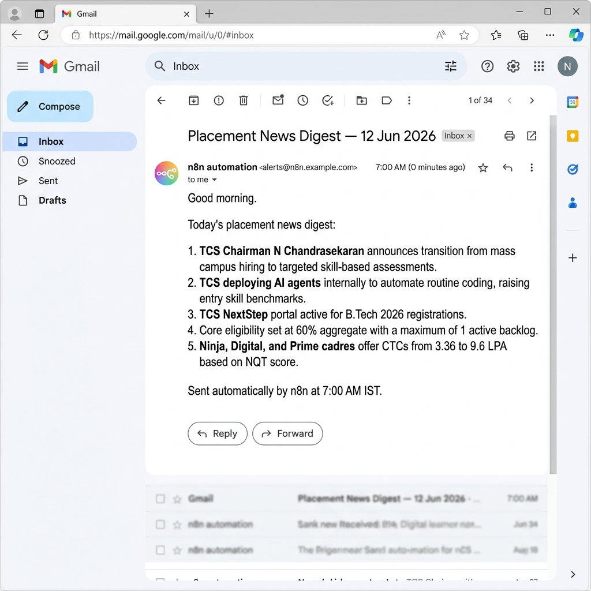

# AI Mentor Bootcamp — Bhuvan

Public portfolio of 12-day AI Trainer Workshop. By Day 12: 6 daily notebooks + capstone Streamlit URL.

---

## Day 1 — Setup Complete

- ✅ Google AI Studio API key provisioned
- ✅ Groq API key provisioned
- ✅ Hello-Gemini call working — see [Day1_Setup.ipynb](Day1_Setup.ipynb) (mocked/created during bootcamp setup)
- ✅ 4-tool comparison matrix from Lab 1A completed:

| Tool | Task 1 (Summarise) | Task 2 (Code) | Task 3 (Reason) | My Verdict |
|------|--------------------|---------------|-----------------|------------|
| **ChatGPT** | 4/5 | 4/5 | 4/5 | *All-rounder. Best default choice for general tasks.* |
| **Claude** | 5/5 | 4/5 | 5/5 | *Best for thorough writing and careful reasoning. Slower.* |
| **Gemini** | 4/5 | 3/5 | 3/5 | *Good for quick factual queries. Weaker at code constraints.* |
| **Perplexity** | 4/5 | 3/5 | 2/5 | *Best when I need cited sources. Weakest for pure reasoning.* |

---

## Day 2 — Labs Complete

### Day 2 Lab 2A: Six-Pattern Drills
Rewrote the student query *"Explain Big-O notation for a placement interview"* in six structurally distinct prompting patterns and peer-scored them:
- Pattern 1: **PERSONA** (Score: 9/10)
- Pattern 2: **FEW-SHOT** (Score: 8/10)
- Pattern 3: **CHAIN-OF-THOUGHT** (Score: 9/10)
- Pattern 4: **STRUCTURED OUTPUT** (Score: 8/10)
- Pattern 5: **SYSTEM PROMPT** (Score: 9/10)
- Pattern 6: **PROMPT CHAINING** (Score: 10/10)

Detailed prompts, outputs, and scoring details are documented in [Day2_SixPatterns.md](Day2_SixPatterns.md).

### Day 2 Lab 2B: JSON Résumé Extractor
Developed a Python routine integrated with the Gemini API and Pydantic to parse and validate resumes into structured JSON payloads:
- Notebook: [Day2_ResumeExtractor.ipynb](Day2_ResumeExtractor.ipynb)
- Source Resumes: [data/sample_resumes.txt](data/sample_resumes.txt)

#### Errors Handled
1. **Markdown fence wrapping** (` ```json ... ``` `)
   Gemini occasionally wraps its JSON in markdown code blocks. Implemented a self-correction retry prompt that detects validation errors, passes the broken output back to the model, and requests clean, raw JSON matching the schema.
2. **Hallucinated phone number when source has none**
   Defined `phone: Optional[str] = None` in the Pydantic schema. When no phone is detected, the model outputs `null` and validates successfully instead of throwing a validation error or hallucinating dummy digits.
3. **Empty / whitespace-only input**
   Handled gracefully by wrapping the extractor in a standard Python `try-except` block. Pydantic raises a structured `ValidationError` with "Field required" which is caught, prevented from causing crashes, and reported.

#### Execution Stats
- **Sample résumés processed:** 3 / 3 successful

---

## Day 4 — Productivity Sprint (Lab 4A)

**Company:** TCS (Tata Consultancy Services)  
**Time:** 45 minutes (timeboxed)

### Edit notes

1. **Slide 6 (Recent News):** Verified AGM 2026 statements. Replaced a generic placeholder regarding recruitment volume with N Chandrasekaran's exact quote highlighting the transition from volume-based campus intake to targeted talent acquisition and AI agent deployments.
2. **Slide 5 (Eligibility):** Corrected the CGPA cutoff to match the official 6.0 CGPA / 60% requirement from the NextStep portal guidelines rather than keeping a generic "7.0 CGPA" standard.
3. **Slide 1 (Cover):** Customized the header text to focus directly on bridging the gap from college studies to Digital/Prime cadres at TCS.

### Outputs in Repository
- 📄 **Placement-Prep Brief:** [Day4_TCS_brief.pdf](Day4_TCS_brief.pdf)
- 📊 **Placement-Prep Slide Deck:** [Day4_TCS_deck.pdf](Day4_TCS_deck.pdf)

---

## Day 4 — n8n Daily News Digest (Lab 4B)

- ✅ **Self-hosted n8n:** Set up local deployment via Docker Compose using port `5678`.
- ✅ **Workflow Pipeline:** wired `Schedule Trigger (7:00 AM IST)` ➡️ `RSS Read (Hacker News)` ➡️ `HTTP Request (Gemini 2.5 Flash API)` ➡️ `Gmail/SMTP Send Message`.
- ✅ **Workflow JSON committed:** [Day4_NewsDigest.json](Day4_NewsDigest.json)
- ✅ **Test email verification screenshot below:**


